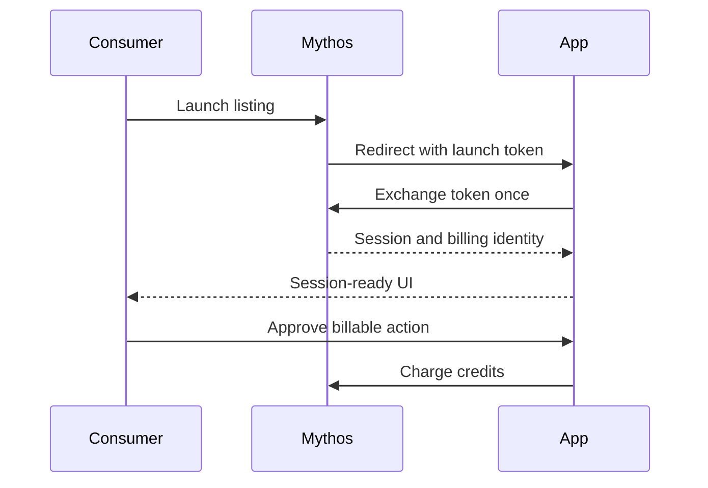

# How it works

Mythos launches a Consumer into your app with a short-lived, signed launch token. The SDK exchanges it once, establishes the app session, and exposes session data to your server and browser code.

## Launch flow

1. The Consumer launches your listing from Mythos.
2. Mythos redirects the browser to your app with a signed, single-use token.
3. The browser client and server handler exchange that token for a secure session.
4. `getSession` returns the Consumer and listing context, or `null` when the app is opened standalone.
5. The browser calls `confirmCharge` before a billable action.
6. The server calls `charge` after approval, or uses `llm` for gateway-routed model billing.

## Publish handshake

Before a listing goes live, Mythos requests `/.well-known/mythos-handshake`. The handler exposed by `mythos.handlers`, `pagesHandler`, `mythosExpress`, or `mythos.router` answers that check. The optional listing-registered callback lets an app persist dynamically created listing IDs.

The SDK does all of this for you. Start with the [quickstart for your framework](quickstart-nextjs-app.md) instead of implementing token exchange or metering yourself.
