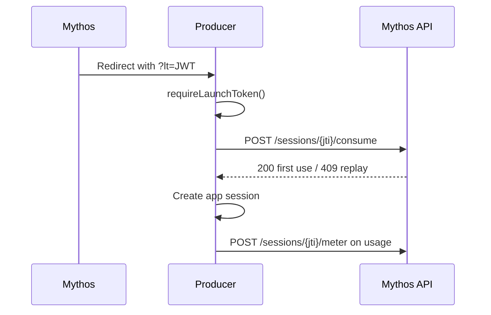

# Integration guide

This guide describes the end-to-end flow for Mythos producers.

## Launch flow

1. A consumer launches your app from the Mythos marketplace.
2. Mythos redirects the browser to your app with `?lt=<JWT>` on the URL.
3. Your protected route uses `requireLaunchToken()` / `require_launch_token`.
4. The SDK verifies the JWT (RS256 + JWKS), then calls `POST /api/apps/sessions/{jti}/consume`.
5. On success, establish your own app session (cookie, server session, etc.) using `sessionJti` and user fields.
6. Redirect to a clean URL **without** `?lt=` so the token is not leaked via Referer or logs.



## Session persistence

The `lt` token is **single-use**. After `/consume` succeeds, the query token cannot be reused.

Store `sessionJti` in your app session — you need it for `reportUsage()`. If the user returns later, authenticate them via your own session mechanism; do not expect a new `lt` until they re-launch from Mythos.

## Metering

Call `reportUsage` when billable work happens:

```typescript
await reportUsage(sessionJti, { credits: 5, reason: 'export' });
```

```python
await report_usage(session_jti, credits=5, reason="export")
```

### Retries and idempotency

Each meter call sends a `charge_id` to the Mythos API. By default the SDK generates a new UUID per call. If a request times out and you retry, you may double-charge.

Pass a stable idempotency key for retries:

```typescript
await reportUsage(jti, { credits: 5, idempotencyKey: 'export-job-123' });
```

```python
await report_usage(jti, credits=5, idempotency_key="export-job-123")
```

### Insufficient funds (402)

`InsufficientFundsError` means the consumer's wallet cannot cover the charge. Return a clear UX message and optionally block the feature.

## Handshake endpoint

Register `/.well-known/mythos-handshake` so Mythos can verify your SDK is installed. Handshake tokens use `purpose: handshake-check` and are separate from launch tokens.

Only `MYTHOS_API_URL` is required for handshake — listing ID is not needed.

## JWT claims (launch tokens)

| Claim | Session field | Notes |
|-------|---------------|-------|
| `sub` | `userId` | Required |
| `email` | `email` | Required |
| `displayName` | `displayName` | Required |
| `listingId` | `listingId` | Must match configured listing ID |
| `jti` | `sessionJti` | Used for consume and meter |
| `aud` | — | Must include your listing ID |
| `iss` | — | Must be `mythos` |

## Troubleshooting

| Symptom | Likely cause |
|---------|--------------|
| 401 Invalid launch token | Expired token, wrong listing ID, or bad signature |
| 401 Token already consumed | User refreshed with same `?lt=` or replay attack |
| 500 config error | `MYTHOS_LISTING_ID` not set |
| 503 Could not verify session | Mythos API unreachable or consume failed |
| 402 on meter | Consumer wallet empty |
| 404 on meter | Session expired or invalid `sessionJti` |

## Do not use `verifyLaunchToken` alone

`verifyLaunchToken()` / `verify_launch_token()` verifies JWT claims but **skips `/consume`**. Using it for route protection violates single-use semantics (ADR-0003). Always use `requireLaunchToken()` / `require_launch_token` for protected routes.
