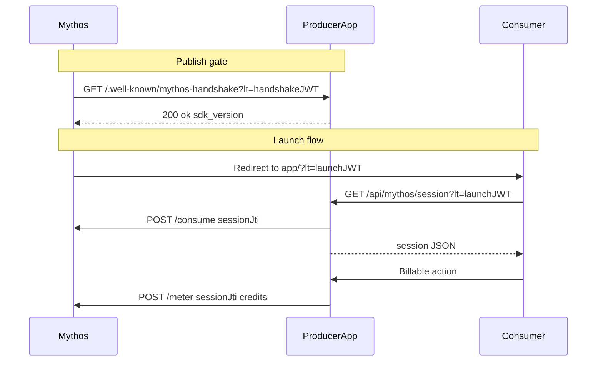

# Mythos SDK — Producer Integration Guide

This guide explains how to integrate the Mythos SDK into a Producer app. For a copy-paste agent prompt, see [PRODUCER_MASTER_PROMPT.md](./PRODUCER_MASTER_PROMPT.md).

---

## How Mythos launch works

1. A **Consumer** discovers your app on the Mythos marketplace and clicks to open it.
2. Mythos redirects them to your app URL with a signed JWT in the query string:

   ```
   https://your-app.example/?lt=<launch-token>
   ```

3. Your **server** verifies the token (RS256 via Mythos JWKS), calls Mythos `/consume` to mark it single-use, and returns session info to your frontend.
4. Your frontend strips `?lt=` from the URL and stores `sessionJti` for billing.
5. After a billable action (e.g. generating a post, running an analysis), your app calls `reportUsage` to debit the Consumer's Mythos wallet.

Before your listing goes live, Mythos runs a **publish handshake**: it pings `GET /.well-known/mythos-handshake?lt=<handshake-token>` on your app. That token has `purpose: "handshake-check"` — it is **not** the same as a launch `?lt=` token.



---

## SDK surface

### Node (`@mythos/sdk`)

| Export | Purpose |
|--------|---------|
| `handshakeRoute()` | Express handler for `/.well-known/mythos-handshake` |
| `requireLaunchToken()` | Express middleware — verify + consume `?lt=` |
| `reportUsage(jti, { credits, reason? })` | Debit Consumer wallet |
| `verifyLaunchToken(token)` | Low-level verify (prefer middleware) |
| `MythosSession` | `{ userId, email, displayName, listingId, sessionJti }` |
| `MythosError`, `InsufficientFundsError`, `SessionNotFoundError` | Typed errors |

**Browser:** Do not import server functions in client bundles — they throw `NOT_IMPLEMENTED`.

### Python (`mythos-sdk`)

| Export | Purpose |
|--------|---------|
| `handshake_router` | FastAPI router with `GET /.well-known/mythos-handshake` |
| `require_launch_token` | FastAPI dependency — verify + consume `?lt=` |
| `report_usage(jti, credits, reason?)` | Debit Consumer wallet |
| `verify_launch_token(token)` | Low-level verify (prefer dependency) |
| `MythosSession` | Dataclass with `session_jti` (snake_case) |

---

## Configuration

| Env var | Required | Default | Description |
|---------|----------|---------|-------------|
| `MYTHOS_LISTING_ID` | Yes* | — | Your listing ID from Mythos dashboard |
| `MYTHOS_LISTING_IDS` | Yes* | — | Comma-separated IDs (overrides single ID) |
| `MYTHOS_API_URL` | No | `https://api.mythos.work` | API base URL override |

*One of `MYTHOS_LISTING_ID` or `MYTHOS_LISTING_IDS` is required.

### Install

**Node:**

```bash
npm install @mythos/sdk
# fallback if not published:
npm install github:Mythoswork/mythos-sdk#main:packages/node
```

**Python:**

```bash
pip install mythos-sdk
# fallback if not published:
pip install "git+https://github.com/Mythoswork/mythos-sdk.git#subdirectory=packages/python"
```

---

## Required routes

All three routes must be reachable on **every** server entry point that serves production traffic.

### 1. Handshake

```
GET /.well-known/mythos-handshake?lt=<handshake-jwt>
```

| Status | Body | Meaning |
|--------|------|---------|
| 200 | `{"ok":true,"sdk_version":"0.1.0"}` | SDK installed and reachable |
| 401 | `{"error":"Missing launch token"}` | No `lt` param |
| 401 | `{"error":"Invalid launch token"}` | Bad/expired/wrong-purpose token |
| 503 | `{"error":"Service unavailable"}` | Unexpected server error |

### 2. Session (frontend exchange)

```
GET /api/mythos/session?lt=<launch-jwt>
```

Uses SDK middleware/dependency to verify signature, validate audience, and call Mythos `/consume`.

| Status | Meaning |
|--------|---------|
| 200 | Token valid and consumed; return session |
| 401 | Missing, invalid, or already-consumed token |
| 503 | Mythos `/consume` unreachable — fail closed |

### 3. Report usage

```
POST /api/mythos/report-usage
```

**Node body:** `{ "sessionJti": "...", "credits": 1, "reason": "page-view" }`  
**Python body:** `{ "session_jti": "...", "credits": 1, "reason": "page-view" }`

| Status | Meaning |
|--------|---------|
| 200 | Billed successfully |
| 402 | Insufficient funds |
| 404 | Session not found |
| 503 | Mythos API error |

---

## Stack recipes

### Express (Node)

```typescript
import express from 'express';
import { handshakeRoute, requireLaunchToken, reportUsage, MythosError } from '@mythos/sdk';

const app = express();
app.use(express.json());

app.get('/.well-known/mythos-handshake', handshakeRoute());

app.get('/api/mythos/session', requireLaunchToken(), (req, res) => {
  res.json({ ok: true, session: req.mythos });
});

app.post('/api/mythos/report-usage', async (req, res) => {
  const { sessionJti, credits, reason } = req.body;
  try {
    await reportUsage(sessionJti, { credits, reason });
    res.json({ ok: true });
  } catch (err) {
    if (err instanceof MythosError) {
      res.status(402).json({ error: err.message });
      return;
    }
    res.status(503).json({ error: 'Failed to report usage' });
  }
});
```

Full stub: [examples/express-routes.ts](./examples/express-routes.ts)

---

### FastAPI (Python)

Create `routers/mythos.py`:

```python
from fastapi import APIRouter, Depends, HTTPException
from mythos_sdk import MythosError, MythosSession, handshake_router, report_usage, require_launch_token
from pydantic import BaseModel

router = APIRouter()
router.include_router(handshake_router)


class MythosSessionResponse(BaseModel):
    userId: str
    email: str
    displayName: str
    listingId: str
    sessionJti: str


@router.get("/api/mythos/session", response_model=MythosSessionResponse)
async def mythos_session(session: MythosSession = Depends(require_launch_token)):
    return MythosSessionResponse(
        userId=session.userId,
        email=session.email,
        displayName=session.displayName,
        listingId=session.listingId,
        sessionJti=session.sessionJti,
    )


class ReportUsageRequest(BaseModel):
    session_jti: str
    credits: int = 1
    reason: str | None = None


@router.post("/api/mythos/report-usage")
async def mythos_report_usage(request: ReportUsageRequest):
    try:
        await report_usage(request.session_jti, request.credits, request.reason)
    except MythosError as e:
        raise HTTPException(status_code=402, detail=str(e)) from e
    return {"success": True}
```

Mount in `main.py`:

```python
from routers import mythos
app.include_router(mythos.router)
```

Full stub: [examples/fastapi-mythos-router.py](./examples/fastapi-mythos-router.py)

---

### Next.js App Router

The SDK exports Express-style handlers. Use a thin shim to run them in Route Handlers.

**`lib/mythos.ts`** — see [examples/next-mythos-shim.ts](./examples/next-mythos-shim.ts)

**`app/.well-known/mythos-handshake/route.ts`:**

```typescript
import { NextResponse, type NextRequest } from "next/server";
import { runHandshake } from "@/lib/mythos";

export const runtime = "nodejs";

export async function GET(request: NextRequest) {
  const lt = request.nextUrl.searchParams.get("lt");
  const { status, body } = await runHandshake(lt);
  return NextResponse.json(body, { status });
}
```

**`app/api/mythos/session/route.ts`:**

```typescript
import { NextResponse, type NextRequest } from "next/server";
import { verifyAndConsumeLaunchToken } from "@/lib/mythos";

export const runtime = "nodejs";

export async function GET(request: NextRequest) {
  const lt = request.nextUrl.searchParams.get("lt");
  if (!lt) return NextResponse.json({ error: "Missing launch token" }, { status: 401 });
  const { status, body } = await verifyAndConsumeLaunchToken(lt);
  return NextResponse.json(body, { status });
}
```

**`app/api/mythos/usage/route.ts`** — POST handler calling `reportUsage` from `@mythos/sdk`.

Set `export const runtime = "nodejs"` on all Mythos routes (JWKS fetch needs Node).

---

### Vercel serverless (vanilla JS)

One file per route under `api/`:

**`api/mythos-handshake.js`:**

```javascript
const { handshakeRoute } = require("@mythos/sdk");
module.exports = handshakeRoute();
```

**`api/mythos-session.js`:**

```javascript
const { requireLaunchToken } = require("@mythos/sdk");
const middleware = requireLaunchToken();
module.exports = (req, res) =>
  middleware(req, res, () => res.status(200).json({ ok: true, session: req.mythos }));
```

For `/.well-known/mythos-handshake`, add a rewrite in `vercel.json`:

```json
{
  "rewrites": [
    { "source": "/.well-known/mythos-handshake", "destination": "/api/mythos-handshake" }
  ]
}
```

Without this rewrite, Vercel serves handshake at `/api/mythos-handshake` only — Mythos publish gate expects the `.well-known` path.

---

## Frontend client

On page load, exchange `?lt=` for a session and strip the token from the URL.

**TypeScript:** [examples/mythos-client.ts](./examples/mythos-client.ts)  
**Vanilla JS:** [examples/mythos-client.js](./examples/mythos-client.js)

Integration steps:

1. Call `initMythosFromUrl()` (or `MythosClient.init()`) on load
2. If session returned, skip your existing auth gate
3. After billable success, call `reportMythosUsage(credits, reason)`

Usage reporting must be **non-fatal** — catch errors and never block the main user flow.

### Wiring to existing auth

| Pattern | Approach |
|---------|----------|
| Password gate | Check `?lt=` **before** password prompt; on success skip modal |
| OAuth | Mythos launch is an alternative entry path; direct visits still use OAuth |
| No auth | Mythos session becomes the only auth when launched from platform |

---

## Idempotency (double-click billing)

Each `reportUsage` call generates a fresh `charge_id` UUID internally. If the user double-clicks a billable button, two calls may produce two charges.

To prevent this, pass a stable idempotency key derived from the action (e.g. post ID, request ID):

```typescript
// When SDK supports chargeId (see mythos-sdk release notes):
await reportUsage(sessionJti, { credits: 1, reason: 'post', chargeId: postId });
```

```python
await report_usage(session_jti, credits=1, reason="post", charge_id=post_id)
```

Generate the key **once per billable action**, not per HTTP retry.

---

## Verification checklist

```bash
# App running on chosen port (8080 recommended on Windows)
curl -i http://127.0.0.1:8080/.well-known/mythos-handshake
# → 401 Missing launch token

curl -i "http://127.0.0.1:8080/.well-known/mythos-handshake?lt=fake"
# → 401 Invalid launch token

curl -i "http://127.0.0.1:8080/api/mythos/session?lt=fake"
# → 401 (not 404)
```

With real tokens from Mythos:

- Handshake JWT → `200 {"ok":true,"sdk_version":"..."}`
- Browser `/?lt=<launch-token>` → app loads without manual auth
- Same launch URL again → fails (token consumed)

**Windows:** use `curl.exe`, not PowerShell `curl`.

---

## Common gotchas

| Issue | Detail |
|-------|--------|
| **Duplicate entry points** | Apps with `backend/main.py` (local) and `api/index.py` (Vercel) need Mythos on both. Local-only wiring breaks production. |
| **Handshake path** | Must be exactly `/.well-known/mythos-handshake`. Custom paths fail publish gate unless you add a rewrite. |
| **Route naming drift** | `/api/mythos/report-usage` vs `/api/mythos/usage` vs `/api/mythos-usage` — pick one, document it, match frontend. |
| **Session JSON shape** | Node apps often wrap `{ session: ... }`; Python apps often return flat fields. Frontend must match. |
| **Body key casing** | Node: `sessionJti`. Python: `session_jti`. |
| **npm/PyPI not published** | Install from GitHub (see Configuration above). |
| **Placeholder tokens** | Test constants like `VALID_HANDSHAKE_TOKEN` are not real JWTs — get tokens from Mythos. |
| **Single-use tokens** | Always strip `?lt=` from URL after session exchange. Refresh without new token = auth failure. |
| **Wrong start command** | FastAPI apps need `uvicorn main:app`, not `python main.py`. |

---

## Security summary

- Tokens verified with RS256 via Mythos JWKS (cached 10 min, auto-refresh on key rotation)
- `alg: none` rejected
- Single-use consume is non-skippable (ADR-0003)
- Never verify tokens in browser code
- Fail closed when `/consume` is unreachable

---

## Links

- [mythos-sdk README](../README.md)
- [Producer master prompt](./PRODUCER_MASTER_PROMPT.md)
- [Example stubs](./examples/)
- GitHub: https://github.com/Mythoswork/mythos-sdk
- Cursor skill: copy `.cursor/skills/integrate-mythos-sdk/` into your project
