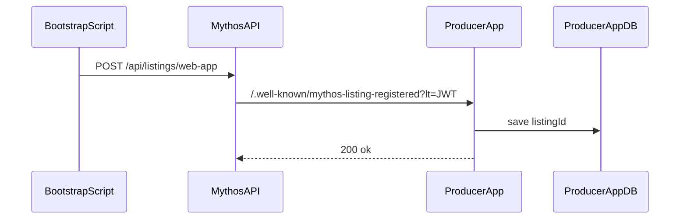

# Dynamic listing IDs

Learn how to receive listing IDs at runtime via the Mythos listing callback — without manual env vars or redeploy.


**Example app:** [Python mock integration app](https://github.com/Mythoswork/mythos-sdk-python-mock-integration-app) exercises this pattern end-to-end.


## Problem

Most Producers set `MYTHOS_LISTING_ID` in `.env` before deploy. That breaks down when:

- Your app creates listings programmatically via the Mythos API
- You run multiple listings against one codebase
- You want bootstrap scripts to register listings without editing env files

## Solution

Mythos POSTs to your app at:

```
GET|POST /.well-known/mythos-listing-registered?lt=<listing-registered-jwt>
```

The JWT has `purpose: "listing_registered"` and contains `listingId`. The SDK validates it and calls your persistence callback.

## Architecture



Later, when a Consumer launches:

1. Launch token `aud` includes the registered listing ID
2. `verifyLaunchToken` checks env IDs **plus** IDs from your store via `resolveListingIds`

## Node.js

```typescript
import { listingCallbackRoute, requireLaunchToken } from '@mythos-work/sdk';

const listingIds: string[] = [];

async function saveListingId(id: string): Promise<void> {
  if (!listingIds.includes(id)) listingIds.push(id);
}

async function getListingIds(): Promise<string[]> {
  return listingIds;
}

app.use('/.well-known/mythos-listing-registered', listingCallbackRoute(saveListingId));

app.get(
  '/api/mythos/session',
  requireLaunchToken({ resolveListingIds: getListingIds }),
  (req, res) => res.json({ ok: true, session: req.mythos }),
);
```

## Python

```python
from mythos_sdk import create_listing_callback_handler, require_launch_token

listing_ids: list[str] = []

async def add_listing_id(listing_id: str) -> None:
    if listing_id not in listing_ids:
        listing_ids.append(listing_id)

async def get_listing_ids() -> list[str]:
    return listing_ids

app.add_api_route(
    "/.well-known/mythos-listing-registered",
    create_listing_callback_handler(add_listing_id),
    methods=["GET", "POST"],
)

@app.get("/api/mythos/session")
async def session(session=Depends(require_launch_token(resolve_listing_ids=get_listing_ids))):
    ...
```

## Persistence

The mock app uses a JSON file (`data/listing-ids.json`). Production apps should use a database or config service. The callback must be idempotent — Mythos may retry.

## Env var fallback

You can combine static and dynamic IDs:

- `MYTHOS_LISTING_ID` — known listings from dashboard
- `resolveListingIds` — IDs learned at runtime

At least one source must be non-empty before launch token verification succeeds.

## Next steps

- [listingCallbackRoute](../reference/node/listing-callback-route.md) · [create_listing_callback_handler](../reference/python/create-listing-callback-handler.md)
- [Mock integration apps](../resources/mock-integration-apps.md)
- [Token types](token-types.md)
