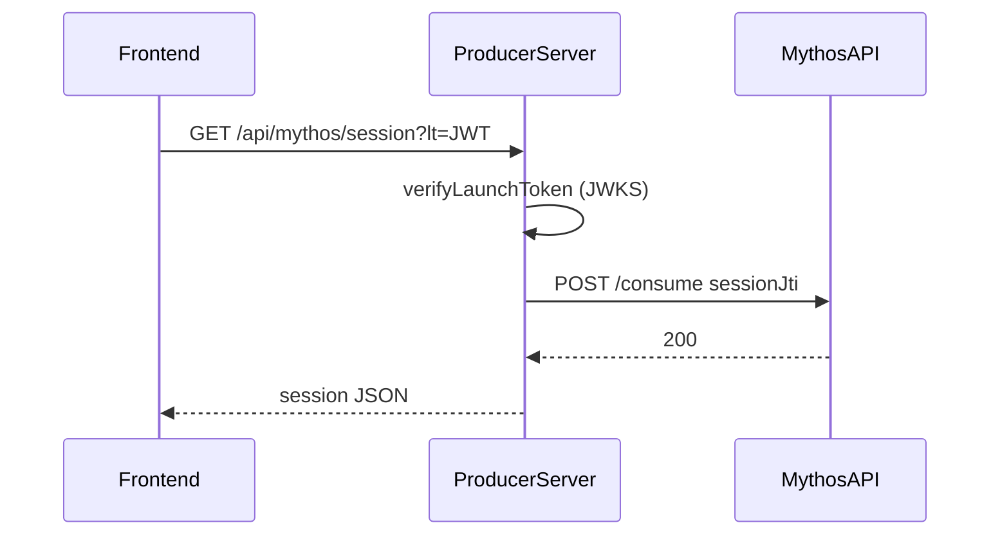

# Launch sessions

Learn how launch tokens are verified, consumed, and enforced as single-use.


**Just getting started?** [Quickstart: Node.js](../getting-started/quickstart-node.md) wires session exchange in minutes.


## Flow

1. Consumer arrives with `?lt=<launch-jwt>`
2. Your server calls `verifyLaunchToken` (or uses `requireLaunchToken` middleware)
3. SDK fetches Mythos JWKS, verifies RS256 signature and issuer `mythos`
4. SDK validates audience (`aud`) against configured listing ID(s)
5. SDK calls `POST /api/apps/sessions/{jti}/consume` on Mythos
6. On success, session is returned to your app / frontend

## MythosSession shape

Both Node and Python return the same field names (camelCase):

| Field | Description |
|-------|-------------|
| `userId` | Consumer's Mythos user ID (`sub` claim) |
| `email` | Consumer email |
| `displayName` | Consumer display name |
| `listingId` | Listing that was launched |
| `sessionJti` | Session ID — use for `reportUsage` / `report_usage` |

## Audience validation

The launch token's `aud` claim must match one of your configured listing IDs:

- From env: `MYTHOS_LISTING_ID` or `MYTHOS_LISTING_IDS`
- From callback: IDs returned by `resolveListingIds` / `resolve_listing_ids`

Python checks **all** `aud` elements when `aud` is an array. Node checks the first audience value.

## Single-use enforcement (ADR-0003)

The SDK **always** calls `/consume` inside `requireLaunchToken` / `require_launch_token`. You cannot skip this step or verify tokens without consuming them via the SDK middleware.

| `/consume` result | HTTP response |
|-------------------|---------------|
| 2xx | Session granted |
| 409 | 401 — token already consumed |
| Network error / 5xx | 503 — fail closed, no access |


Fail closed: if Mythos `/consume` is unreachable, return 503. Never grant access without a confirmed consume.


## JWKS caching

Public keys are fetched from Mythos JWKS endpoint and cached for 10 minutes. On key rotation (kid miss), the SDK re-fetches once automatically.

## Frontend responsibilities

After session exchange:

1. Store `sessionJti` for billing
2. **Strip `?lt=` from the URL** — `history.replaceState` even on failure
3. Do not store or re-use the raw launch JWT

## Next steps

- [requireLaunchToken](../reference/node/require-launch-token.md) · [require_launch_token](../reference/python/require-launch-token.md)
- [Frontend client](../guides/frontend-client.md)
- [Token types](token-types.md)
