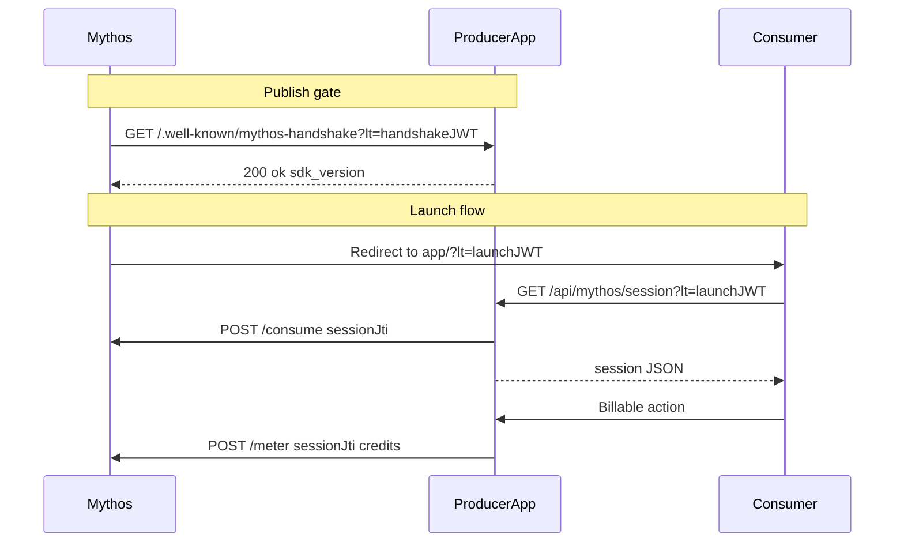

# How it works

Understand the full Mythos launch flow — from publish handshake to wallet debit.


**Just getting started?** Follow [Quickstart: Node.js](quickstart-node.md) or [Quickstart: Python](quickstart-python.md) to wire this up in minutes.


## Overview

When a Consumer opens your app from the Mythos marketplace, Mythos redirects them to your app URL with a signed JWT in the query string:

```
https://your-app.example/?lt=<launch-token>
```

Your server verifies the token, calls Mythos `/consume` to mark it single-use, and returns session info to your frontend. After a billable action, your app debits the Consumer's wallet via `reportUsage`.

Before your listing goes live, Mythos runs a **publish handshake**: it pings `GET /.well-known/mythos-handshake?lt=<handshake-token>` on your app. That token has `purpose: "handshake-check"` — it is **not** the same as a launch `?lt=` token.

## Sequence diagram



## Phase 1: Publish handshake

When you publish a listing, Mythos sends a short-lived JWT with `purpose: "handshake-check"` to your handshake endpoint. The SDK validates the signature and purpose, then returns:

```json
{ "ok": true, "sdk_version": "0.1.0" }
```

If this fails (404, 401, timeout), your listing cannot go live. See [handshakeRoute](../reference/node/handshake-route.md).

## Phase 2: Consumer launch

1. Consumer clicks your listing on Mythos
2. Mythos redirects to `https://your-app/?lt=<launch-jwt>`
3. Your frontend reads `lt` and calls your session endpoint
4. Your server verifies the JWT (RS256, audience, issuer), calls `/consume`, returns session
5. Frontend strips `?lt=` from the URL and stores `sessionJti`

See [Launch sessions](../concepts/launch-sessions.md) and [Token types](../concepts/token-types.md).

## Phase 3: Usage metering

After a successful billable action (e.g. generating a post, running an analysis), your server calls `reportUsage(sessionJti, { credits, reason })`. Mythos debits the Consumer's wallet.

Usage reporting on the frontend should be **non-fatal** — never block the user's main flow if billing fails. See [Usage metering](../concepts/usage-metering.md).

## Optional: Dynamic listing IDs

If your app creates listings programmatically, Mythos can POST to `/.well-known/mythos-listing-registered` with a `listing_registered` token so your app learns its `listingId` without a manual env var. See [Dynamic listing IDs](../concepts/dynamic-listing-ids.md).

## Next steps

- [Install the SDK](install.md)
- [Required routes](../guides/required-routes.md) — status codes and response shapes
- [Verify your integration](verify-integration.md) — curl checklist
